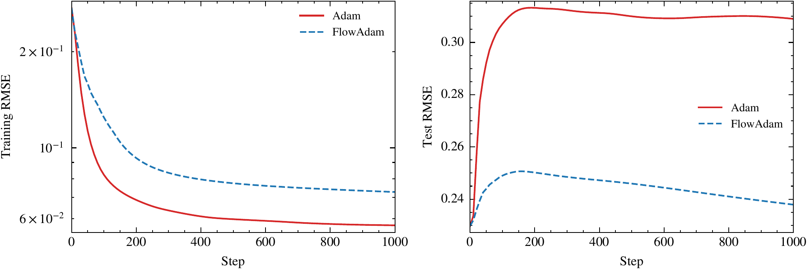
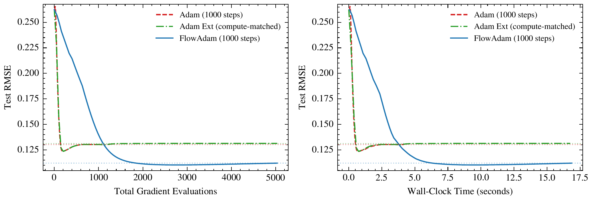
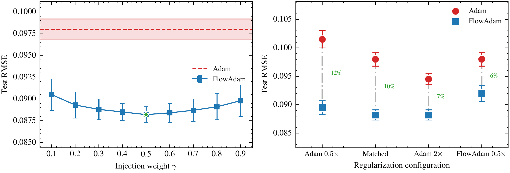
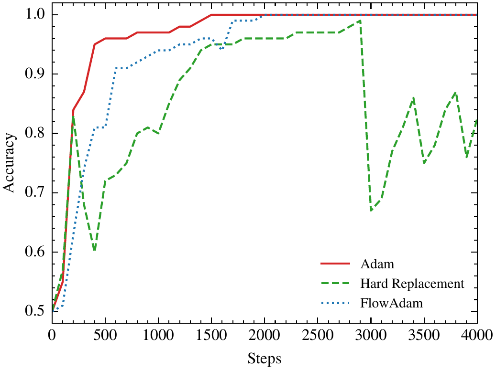

<h1 align="center">FlowAdam Optimizer</h1>
<h3 align="center">IJCNN 2026 (IEEE WCCI 2026): Implicit Regularization via Geometry-Aware Soft Momentum Injection</h3>

Repository for the IJCNN 2026 paper:
**"FlowAdam: Implicit Regularization via Geometry-Aware Soft Momentum Injection"**.

## Table of Contents
- [Overview](#overview)
- [Key Idea](#key-idea)
- [Key Results](#key-results)
- [Installation](#installation)
- [Quick Start](#quick-start)
- [Recommended Settings](#recommended-settings)
- [Reproducing Paper Experiments](#reproducing-paper-experiments)
- [Repository Structure](#repository-structure)
- [Citation](#citation)
- [License](#license)

## Overview
FlowAdam is a hybrid optimizer that extends Adam with short, clipped ODE-based gradient-flow integration when EMA statistics indicate difficult geometry (plateaus or stiff regions).

The main design goal is to preserve Adam's practical stability while improving optimization behavior in strongly coupled, non-diagonal landscapes common in scientific ML and structured factorization problems.

## Key Idea
FlowAdam introduces **soft momentum injection** during ODE transitions:
- ODE velocity is blended into Adam momentum instead of replacing it.
- This avoids abrupt state resets and reduces transition instability.
- The optimizer retains Adam's adaptive scaling while gaining geometric correction from flow integration.

## Key Results

### Implicit Regularization via Matrix Completion
<p align="center">
  
</p>

### Compute-Fairness Analysis
<p align="center">
  
</p>

### Sensitivity Analysis
<p align="center">
  
</p>

### Ablation: Hard vs Soft Injection
<p align="center">
  <a href="figures/ablation_injection.png">
    
  </a>
</p>

## Installation
```bash
git clone https://github.com/idevender/flowadam.git
cd flowadam
pip install -e .
```

## Quick Start
```python
from flowadam import FlowAdam

optimizer = FlowAdam(
    model.parameters(),
    lr=1e-3,
    mode="B",  # "A" for stochastic NN training, "B" for scientific ML/full-batch style
)

# FlowAdam evaluates the loss multiple times per step (ODE integration),
# so it requires a closure that zeroes grads, computes the loss, and calls backward().
for step in range(num_steps):
    def closure():
        optimizer.zero_grad()
        loss = compute_loss(model, batch)
        loss.backward()
        return loss
    optimizer.step(closure)
```

## Recommended Settings
FlowAdam exposes two paper-aligned presets via `mode`:

| Mode | Typical Use Case | switch_sensitivity | curvature_sensitivity | ode_t_scale |
|---|---|---:|---:|---:|
| `A` | Stochastic neural network training | 0.40 | 3.0 | 2.0 |
| `B` | Scientific ML / stiffer deterministic regimes | 0.90 | 0.1 | 0.5 |

These match Mode A and Mode B in the paper (Section III-E). You can still override
them explicitly through constructor arguments; several experiment scripts do.

## Reproducing Paper Experiments
All experiments are standalone scripts under `experiments/`. Install the experiment
dependencies first:

```bash
pip install -r requirements.txt   # or: pip install -e ".[experiments]"
```

Examples:
```bash
python experiments/matrix_completion.py
python experiments/tensor_completion.py
python experiments/robust_factorization.py
python experiments/gnn_link_prediction.py
python experiments/inverse_kinematics.py
python experiments/jester.py
python experiments/movielens.py
python experiments/cifar10.py
python experiments/rosenbrock.py
python experiments/two_spirals.py
python experiments/rotated_quadratic.py
python experiments/ablation_injection.py
python experiments/gamma_ablation.py
```

See `experiments/README.md` for per-script descriptions.

## Repository Structure
```text
flowadam/
├── flowadam/
│   ├── __init__.py
│   └── optimizer.py
├── experiments/
│   ├── README.md
│   └── *.py
├── README.md
├── requirements.txt
├── setup.py
└── LICENSE
```

## Citation
```bibtex
@inproceedings{singh2026flowadam,
  title={FlowAdam: Implicit Regularization via Geometry-Aware Soft Momentum Injection},
  author={Singh, Devender and Sheel, Tarun},
  booktitle={International Joint Conference on Neural Networks (IJCNN)},
  year={2026}
}
```

## License
MIT
